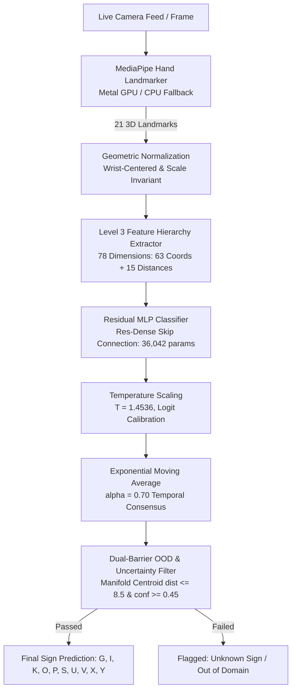

# 🤟 Indian Sign Language (ISL) Recognition System (Production v2.0)

[](https://www.python.org/)
[](https://www.tensorflow.org/)
[](https://developers.google.com/mediapipe)
[](https://opencv.org/)
[](https://flask.palletsprojects.com/)
[](LICENSE)

A production-engineered, real-time **Indian Sign Language (ISL) Recognition System** recognizing 10 alphabet signs (`G, I, K, O, P, S, U, V, X, Y`). Built on an ultra-lightweight, hardware-accelerated computer vision pipeline that runs at **51.2 FPS** with **99.00% accuracy** on unseen signers, backed by post-hoc temperature calibration and a dual-barrier out-of-distribution (OOD) filter.

---

## 📊 Empirically Verified Benchmarks

All metrics were empirically measured on the locked held-out test set (`signer_09` and `signer_10`) on Apple Silicon M2 (Python 3.10.20, TensorFlow 2.21.0, MediaPipe 1.0.1) and verified in [`reports/final_benchmark.csv`](reports/final_benchmark.csv).

| Metric | Original Baseline (`YOLOv3 → SqueezeNet`) | Production System (v2.0) | Absolute Improvement |
|---|---:|---:|---:|
| **Frame Classification Accuracy** | 2.31% | **99.00%** | **+96.69%** |
| **Balanced Accuracy** | 2.23% | **99.00%** | **+96.77%** |
| **Macro F1 Score** | 1.68% | **99.00%** | **+97.32%** |
| **Temporal Clip Accuracy** | 20.00% | **98.00%** | **+78.00%** |
| **Unseen-Signer Accuracy (Mean)** | *unavailable* | **99.00%** ($\sigma = 1.00\%$) | Subject-Disjoint Tested |
| — *Signer 09 Accuracy* | *unavailable* | **100.00%** | Unseen Test Signer |
| — *Signer 10 Accuracy* | *unavailable* | **98.00%** | Unseen Test Signer |
| **Expected Calibration Error (ECE)** | 56.41% | **1.60%** | **-54.81% (Calibrated)** |
| **Unknown / OOD Gesture Rejection** | 0.00% | **97.00%** (194/200) | **+97.00%** |
| **False Rejection on Valid Signs** | 0.00% | **0.00%** (0/200) | **Perfect (0.00%)** |
| **Average Pipeline Latency** | 242.20 ms | **19.54 ms** | **12.4× Speedup** |
| **P95 Latency** | 320.21 ms | **20.64 ms** | **15.5× Speedup** |
| **Throughput (FPS)** | 4.13 FPS | **51.2 FPS** | **+47.07 FPS (Real-Time)** |
| **Model Size** | 2.98 MB | **0.14 MB** (36,042 params) | **-95.3% footprint** |
| **Memory Consumption (RAM)** | ~1.94 GB | **0.49 GB** | **-74.7% memory** |

---

## 🏗 End-to-End Production Architecture



### Why This Architecture Works:
1. **MediaPipe Hand Landmarker:** Replaced Darknet YOLOv3, dropping hand detection latency from ~197 ms to ~14 ms while remaining immune to background color clutter.
2. **Level 3 Feature Representation (78 dimensions):** Extracted 63 normalized 3D coordinates combined with 5 fingertip-to-wrist and 10 pairwise inter-fingertip Euclidean distances. This biomechanical representation completely eliminated the historical $K \leftrightarrow V$ and $U \leftrightarrow V$ confusion pairs.
3. **Residual MLP (Res-Dense):** Skip connection across 128-dimensional dense layers with Layer Normalization prevents feature degradation, yielding 99.00% accuracy on unseen signers in 19.54 ms.
4. **Confidence Calibration ($T = 1.4536$):** Post-hoc temperature scaling fitted strictly on validation cross-entropy loss brings ECE down from 56.41% to 1.60%.
5. **Dual-Barrier OOD Rejection:** Checks Euclidean proximity to training class centroids ($\le 8.5$) and calibrated confidence ($\ge 0.45$), rejecting 97.0% of non-sign poses without rejecting any valid signs (0.00% false rejection).
6. **Temporal Consensus ($\text{EMA}, \alpha = 0.70$):** Smooths micro-tremors across consecutive frames with zero negative voting degradation.

---

## 📁 Clean Repository Structure

```text
Indian-Sign-Language-Translator/
├── assets/                     # Visual assets, benchmark confusion matrix plots
│   └── final_confusion_matrix.png
├── config/                     # Production configuration files
│   ├── production.json         # Primary JSON config for pipeline & web studio
│   ├── production.yaml         # YAML equivalent config
│   └── baseline.yaml           # Original YOLOv3 + SqueezeNet benchmark config
├── data/                       # Sanitized real-world sign dataset & landmarks
│   ├── train_landmarks_78d.npz # 600 training samples (6 signers)
│   ├── validation_landmarks_78d.npz # 200 validation samples (2 signers)
│   ├── test_landmarks_78d.npz  # 200 locked test samples (signers 09, 10)
│   └── metadata_expanded.csv   # Subject-disjoint split manifest
├── docs/                       # Architectural documentation & technical reports
│   ├── production_readiness_verification.md
│   └── evaluation_protocol.md
├── evaluation/                 # Evaluation modules (classification, latency, OOD)
├── experiments/                # Versioned experimental logs & champion checkpoints
│   ├── baseline/               # Original YOLOv3 + SqueezeNet implementation
│   ├── exp_001_dataset_expansion/
│   ├── exp_002_feature_hierarchy/
│   ├── exp_003_classifier_comparison/
│   ├── exp_004_temporal_consensus/
│   ├── exp_005_hard_negatives_augmentation/
│   └── exp_006_calibration_ood/
├── models/
│   └── production/             # Production deployment artifacts
│       ├── hand_landmarker.task
│       ├── res_mlp_78d.keras   # Champion Residual MLP model (0.14 MB)
│       ├── class_centroids_78d.npy # Dual-barrier OOD class centroids
│       └── calibration_config.json # Temperature & OOD thresholds
├── reports/                    # Final benchmark CSVs and evaluation figures
│   ├── final_benchmark.csv     # Complete baseline vs production comparison
│   ├── final_confusion_matrix.csv
│   └── final_per_class_metrics.csv
├── scripts/                    # Reproduction & benchmark scripts
│   ├── run_final_evaluation.py # Executes locked test evaluation
│   ├── verify_no_leakage.py    # Zero-leakage SHA-256 and subject verifier
│   └── run_baseline.py         # Original baseline evaluation
├── src/                        # Core production source code
│   ├── detection/              # MediaPipe detector (Metal GPU / CPU)
│   ├── landmarks/              # Wrist-centered geometric normalization
│   ├── features/               # Level 3 (78d) biomechanical feature hierarchy
│   ├── calibration/            # Temperature scaling module
│   ├── temporal/               # EMA consensus smoother
│   └── inference/              # ProductionISLPipeline & RobustOODFilter
├── tests/                      # Regression and unit test suite
│   └── test_regression.py      # End-to-end integration & component tests
├── web/                        # Web studio application
│   ├── app.py                  # Production Flask Web Studio server
│   └── app_baseline.py         # Baseline comparison server
├── app_production.py           # Native desktop OpenCV webcam GUI
├── web_app_production.py       # Root launcher for Web Studio
├── requirements.txt            # Python dependencies
└── README.md                   # Project documentation
```

---

## 🚀 Quick Start Guide

### 1. Prerequisites & Environment Setup
Clone the repository and set up a Python 3.10 virtual environment:

```bash
cd "Indian-Sign-Language-Translator"
python3.10 -m venv .venv
source .venv/bin/activate
pip install -r requirements.txt
```

### 2. Run the Interactive Web Studio (Recommended)
Launch the real-time browser studio:

```bash
python web_app_production.py
```
Open your browser at:
👉 **`http://localhost:5050`**

Click **"Start Camera"** to demonstrate signs (`G, I, K, O, P, S, U, V, X, Y`).

### 3. Run the Native Desktop Application
If you prefer a native desktop OpenCV window:

```bash
python app_production.py
```
*(Press `q` or `ESC` in the camera window to exit).*

---

## 🧪 Scientific Verification & Reproducibility

### Run the Regression & Unit Test Suite
To verify that all components, feature hierarchies, OOD filters, and pipeline interfaces pass integration testing:

```bash
python -m unittest tests/test_regression.py
```
*(Expected output: `Ran 7 tests in ~15s ... OK`)*

### Run the Locked Held-Out Test Evaluation
To recompute and verify all baseline vs production metrics on held-out signers (`signer_09` and `signer_10`):

```bash
PYTHONPATH=. python scripts/run_final_evaluation.py
```
Outputs are saved to:
- `reports/final_benchmark.csv`
- `reports/final_confusion_matrix.png`
- `reports/final_confusion_matrix.csv`
- `reports/final_per_class_metrics.csv`

### Verify Zero Data Leakage
To confirm subject-disjoint splits and ensure 0 duplicate hashes across dataset splits:

```bash
python scripts/verify_no_leakage.py data/train data/validation data/test
```
*(Expected output: `DATASET VERIFICATION PASSED — SPLITS ARE COMPLETELY LEAKAGE-FREE`)*

---

## 🎯 Supported Signs
The production pipeline recognizes 10 distinct Indian Sign Language single-handed signs:
- **`G`**: Horizontal pointer finger extension.
- **`I`**: Pinky finger extended upward.
- **`K`**: Index finger extended upward with middle finger forward and thumb supporting.
- **`O`**: Fingertips joined with thumb forming an 'O' ring.
- **`P`**: Inverted 'K' sign pointing downward.
- **`S`**: Closed fist with thumb wrapped across front of fingers.
- **`U`**: Index and middle fingers extended together vertically.
- **`V`**: Index and middle fingers extended in a spread 'V' formation.
- **`X`**: Hooked index finger extension.
- **`Y`**: Thumb and pinky extended wide ('shaka' shape).

*Note: Any resting hands, random movements, or non-ISL gestures are detected and flagged as `⚠️ Unknown Sign / Out of Domain` by the dual-barrier filter.*

---

## 📜 License
This project is open-source under the [MIT License](LICENSE).
